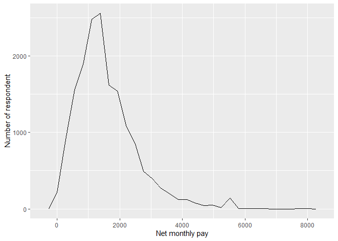
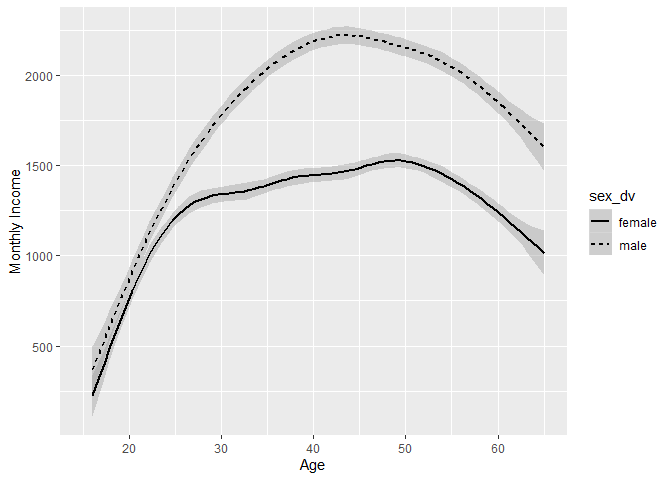
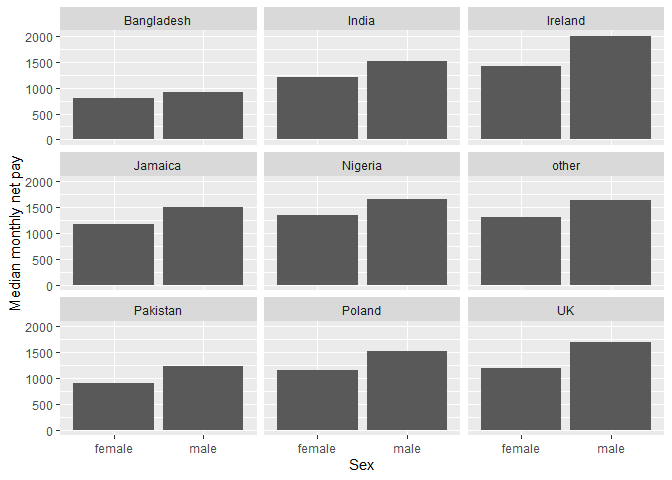
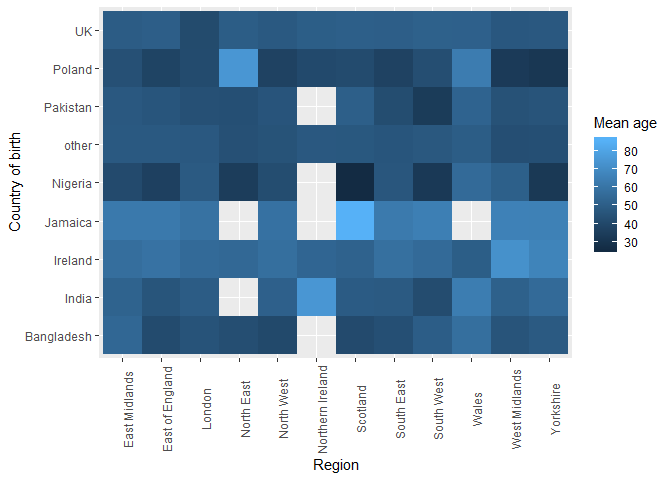
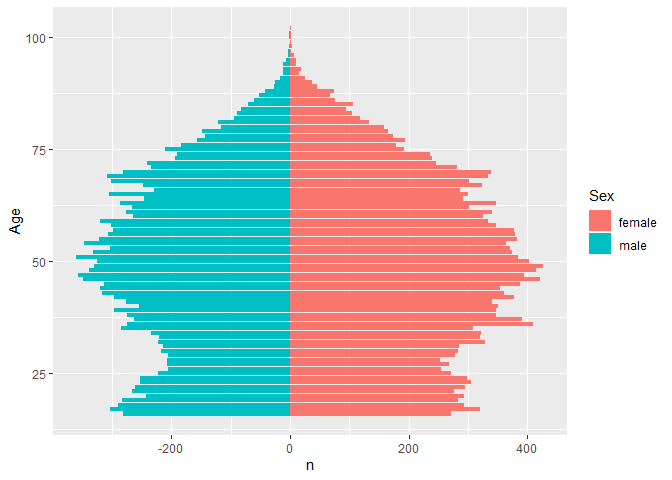

Statistical assignment 4
================
Nina Cunningham
3rd March

In this assignment you will need to reproduce 5 ggplot graphs. I supply graphs as images; you need to write the ggplot2 code to reproduce them and knit and submit a Markdown document with the reproduced graphs (as well as your .Rmd file).

First we will need to open and recode the data. I supply the code for this; you only need to change the file paths.

    ```r
    library(tidyverse)
    Data8 <- read_tsv("C:/Users/ninaj/Documents/datan3/datan3-master/UKDA-6614-tab/tab/ukhls_w8/h_indresp.tab")
    Data8 <- Data8 %>%
        select(pidp, h_age_dv, h_payn_dv, h_gor_dv)
    Stable <- read_tsv("C:/Users/ninaj/Documents/datan3/datan3-master/UKDA-6614-tab/tab/ukhls_wx/xwavedat.tab")
    Stable <- Stable %>%
        select(pidp, sex_dv, ukborn, plbornc)
    Data <- Data8 %>% left_join(Stable, "pidp")
    rm(Data8, Stable)
    Data <- Data %>%
        mutate(sex_dv = ifelse(sex_dv == 1, "male",
                           ifelse(sex_dv == 2, "female", NA))) %>%
        mutate(h_payn_dv = ifelse(h_payn_dv < 0, NA, h_payn_dv)) %>%
        mutate(h_gor_dv = recode(h_gor_dv,
                         `-9` = NA_character_,
                         `1` = "North East",
                         `2` = "North West",
                         `3` = "Yorkshire",
                         `4` = "East Midlands",
                         `5` = "West Midlands",
                         `6` = "East of England",
                         `7` = "London",
                         `8` = "South East",
                         `9` = "South West",
                         `10` = "Wales",
                         `11` = "Scotland",
                         `12` = "Northern Ireland")) %>%
        mutate(placeBorn = case_when(
                ukborn  == -9 ~ NA_character_,
                ukborn < 5 ~ "UK",
                plbornc == 5 ~ "Ireland",
                plbornc == 18 ~ "India",
                plbornc == 19 ~ "Pakistan",
                plbornc == 20 ~ "Bangladesh",
                plbornc == 10 ~ "Poland",
                plbornc == 27 ~ "Jamaica",
                plbornc == 24 ~ "Nigeria",
                TRUE ~ "other")
        )
    ```

Reproduce the following graphs as close as you can. For each graph, write two sentences (not more!) describing its main message.

1.  Univariate distribution (20 points).

    ``` r
    Data %>%
      ggplot(aes(x = h_payn_dv)) +
      geom_freqpoly() +
      xlab("Net monthly pay") +
      ylab("Number of respondent")
    ```

     This graph suggests that most people earn around £1400 per month. The distibution is skewed to the left showing that the higher salaries are more variable and the lower salaries are more condensed.

2.  Line chart (20 points). The lines show the non-parametric association between age and monthly earnings for men and women.

    ``` r
    Data %>%
        ggplot(aes(x = h_age_dv, y = h_payn_dv, group = sex_dv)) +
        geom_smooth(aes(linetype = sex_dv), color = "black") +
        xlim(15, 65)+
        xlab("Age") +
        ylab("Monthly Income")
    ```

     The graph suggests that there is a pay gap between females and males, with females being paid on average less than then males. People are paid most at the age of 35 to 55 with people gaining promotions through experience, which compared to younger people just starting work and older people who are beginning the process of retirement.

3.  Faceted bar chart (20 points).

    ``` r
    medianbysex <- Data %>%
      filter(!is.na(sex_dv)) %>%
      filter(!is.na(placeBorn)) %>%
      group_by(placeBorn, sex_dv) %>%
      summarise(medianIncome = median(h_payn_dv, na.rm = TRUE))

    medianbysex %>%
      ggplot(aes(x = sex_dv, y = medianIncome))+
      geom_bar(stat = 'identity') +
      ylim(0, 2000) +
      facet_wrap(~placeBorn) +
      xlab("Sex") +
      ylab("Median monthly net pay")
    ```

     The faceted graph suggests that across all ethnicities, women are on average paid less than men. Irish people are paid the most on average compared to people from Bangladesh and Pakistan who are paid the least, which is consistent across genders.

4.  Heat map (20 points).

    ``` r
    MeanAge <- Data %>%
      filter(!is.na(h_gor_dv)) %>%
      filter(!is.na(placeBorn)) %>%
      group_by(h_gor_dv, placeBorn) %>%
      mutate(meanage = mean(h_age_dv))

    MeanAge %>%
      ggplot(aes(x = h_gor_dv, y = placeBorn, fill = meanage)) +
      geom_tile(stat = 'identity') +
      theme(axis.text.x = element_text(angle = 90)) +
      xlab("Region") +
      ylab("Country of birth") +
      labs(fill = "Mean age")
    ```

     The heatmap suggests that there is not much of a difference pattern in age among reading and place of birth. The two notable counties are Jamaica, with older people on average (particularly in Scotland) and Nigeria with younger people on average (also in Scotland).

5.  Population pyramid (20 points).

    ``` r
    Data %>%
      ggplot(mapping = aes(x = h_age_dv, fill = sex_dv)) +
      geom_bar(data = subset(Data, sex_dv == "female")) + 
      geom_bar(data = subset(Data, sex_dv == "male"), aes(y = ..count..*(-1))) +
      coord_flip() +
      xlab("Age") +
      ylab("n") +
      labs(fill = "Sex")
    ```

     The population pyramid suggests that the population of the UK is middle aged with age decreasing as you get older and less young people being present. The graph is also fairly symmetrical, suggesting a balance between females and males.
